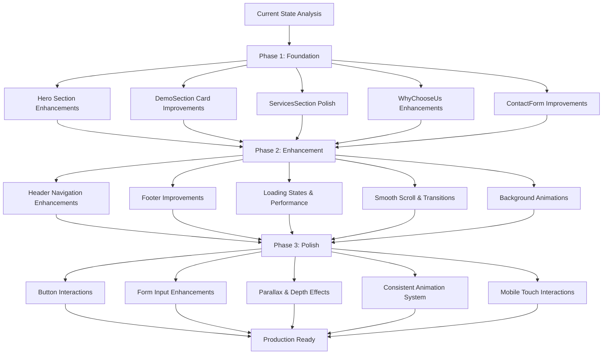

# GUI Enhancement Implementation Workflow

## Key Implementation Principles

1. **Incremental Enhancement**: Each phase builds upon the previous
2. **Consistent Experience**: Maintain design system throughout
3. **Performance First**: Optimize animations for 60fps
4. **Mobile Responsive**: Ensure touch interactions work seamlessly
5. **Accessibility**: Respect user preferences and maintain keyboard navigation

## Testing Strategy

- Cross-browser compatibility testing
- Mobile device testing
- Performance monitoring
- Accessibility validation
- User feedback collection

## Rollout Plan

1. Implement Phase 1 changes
2. Test and validate
3. Deploy Phase 1
4. Monitor performance
5. Proceed to Phase 2
6. Repeat process for all phases